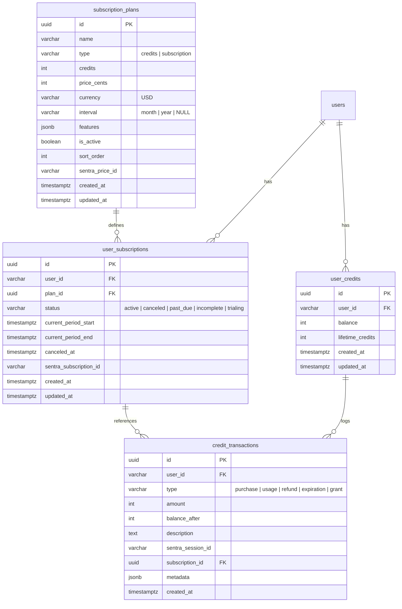
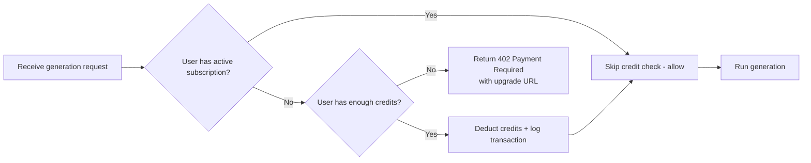

# Payment System Architecture — ViewCreator

> **Status**: Spec — Ready for Sentra Integration
> **Last Updated**: 2026-07-04

---

## Overview

ViewCreator uses a dual-model payment system:

1. **Credits (Pay-as-you-go)** — Users buy bundles of credits, each generation costs a fixed number of credits
2. **Subscription (Monthly/Annual)** — Recurring fee for unlimited generations

Both models are powered by **Sentra** for payment processing (checkout, webhooks, customer portal).

---

## Data Model

### Tables (to be added to `schema.sql`)



### Seed Plan Data

```sql
-- Credit packs
INSERT INTO subscription_plans (name, type, credits, price_cents, interval, features, sort_order, sentra_price_id)
VALUES
  ('Starter Pack',  'credits',      100,  900, NULL,  '["Generate up to 100 images or 20 videos","All aspect ratios & sizes","Standard quality","Reference image upload","7-day expiry"]',                              1, NULL),
  ('Creator Pack',  'credits',      500,  3900, NULL, '["Generate up to 500 images or 100 videos","All aspect ratios & sizes","Premium quality","Reference image upload (up to 3)","30-day expiry","Priority queue"]',    2, NULL),
  ('Pro Pack',      'credits',      2000, 12900, NULL,'["Generate up to 2000 images or 400 videos","All aspect ratios & sizes","Premium quality","Reference image upload (up to 5)","90-day expiry","Priority queue","Early access"]', 3, NULL),
  ('Monthly',       'subscription', 0,    2900, 'month', '["Unlimited image & video generation","All aspect ratios & sizes","Premium quality","Reference image upload (up to 10)","Priority queue","All templates unlocked","Early access"]', 4, NULL),
  ('Annual',        'subscription', 0,    29000, 'year', '["Everything in Monthly","Priority support","Cancel anytime"]', 5, NULL);
```

---

## API Endpoints (`viewcreator-api`)

All endpoints under `/api/payments/*`. Auth-protected where applicable.

### `GET /api/payments/plans` — List Plans

**Auth**: None (public — shows active plans for pricing page)

**Response**:
```json
{
  "creditPacks": [
    { "id": "uuid", "name": "Starter Pack", "credits": 100, "price_cents": 900, "display_price": "$9", "features": [...] }
  ],
  "subscriptions": [
    { "id": "uuid", "name": "Monthly", "price_cents": 2900, "display_price": "$29", "interval": "month", "features": [...] }
  ]
}
```

### `GET /api/payments/balance` — User Balance

**Auth**: Required

**Response**:
```json
{
  "credits": { "balance": 420, "lifetime_credits": 1000 },
  "subscription": {
    "id": "uuid",
    "plan_name": "Monthly",
    "status": "active",
    "current_period_end": "2026-08-04T00:00:00Z"
  }
}
```

### `POST /api/payments/create-checkout` — Create Checkout

**Auth**: Required

**Request**:
```json
{
  "plan_id": "uuid",
  "success_url": "https://viewcreator.com/generate",
  "cancel_url": "https://viewcreator.com/pricing"
}
```

**Response**:
```json
{
  "checkout_url": "https://sentra.com/checkout/..."
}
```

**Logic**:
1. Look up plan by `plan_id`
2. Create Sentra checkout session with `sentra_price_id` and user metadata
3. Store `sentra_session_id` → plan mapping for webhook processing
4. Return checkout URL

### `POST /api/payments/webhook` — Sentra Webhook

**Auth**: Sentra webhook signature verification

**Events to handle**:
| Event | Action |
|-------|--------|
| `checkout.session.completed` | Grant credits or activate subscription |
| `customer.subscription.updated` | Update subscription status |
| `customer.subscription.deleted` | Mark subscription as canceled |
| `invoice.payment_failed` | Mark subscription as past_due |

### `POST /api/payments/portal` — Customer Portal

**Auth**: Required

**Logic**:
1. Create Sentra billing portal session
2. Return portal URL for managing payment methods, viewing invoices, canceling

---

## Credit Cost Matrix

| Action | Credit Cost |
|--------|------------|
| Image generation (standard) | 1 credit |
| Image generation (premium) | 2 credits |
| Video generation | 5 credits |
| AI edits / refinements | 1 credit |

---

## Integration Points

### 1. Credit Deduction on Generation

In `POST /api/generate` and `POST /api/generate/video`:



### 2. UI Credit Display

In the site header (signed-in state), show:
- **Subscription users**: Icon + "Unlimited" badge with subscription name
- **Credit users**: Icon + remaining credit count (e.g., "420 credits")
- **No balance users**: "Buy credits" link → `/pricing`

### 3. Pricing Page → Checkout Flow

```mermaid
flowchart LR
    A[/pricing] --> B{User clicks "Buy" or "Subscribe"}
    B --> C{Is user signed in?}
    C -->|No| D[Redirect to Clerk sign-in]
    C -->|Yes| E[POST /api/payments/create-checkout]
    E --> F[Redirect to Sentra checkout]
    F --> G[Sentra webhook → credit/subscription activation]
    G --> H[Redirect to /generate]
```

---

## Sentra Integration Plan

### Step 1: Create Products in Sentra Dashboard

Create these products with their prices:

| Product | Type | Price | Sentra Price ID |
|---------|------|-------|-----------------|
| Starter Pack | One-time | $9 | `price_starter_xxx` |
| Creator Pack | One-time | $39 | `price_creator_xxx` |
| Pro Pack | One-time | $129 | `price_pro_xxx` |
| Monthly Subscription | Recurring | $29/mo | `price_monthly_xxx` |
| Annual Subscription | Recurring | $290/yr | `price_annual_xxx` |

### Step 2: Backend Implementation Order

1. Add DB tables + migration script
2. Create `PlanRepository` and `CreditRepository` in `viewcreator-database`
3. Implement plan listing endpoint (no Sentra dependency)
4. Implement balance/status endpoint
5. Implement create-checkout endpoint (Sentra)
6. Implement webhook handler (Sentra — most critical)
7. Implement customer portal (Sentra)
8. Add credit check/deduction to generation endpoints

### Step 3: Frontend Implementation Order

1. ✅ Pricing page (done)
2. Add plan service (`api/payment-service.ts`)
3. Wire pricing page "Buy" buttons to checkout flow
4. Add credit balance display in site header
5. Add credit-gating in generate form (disable if insufficient credits)
6. Add upgrade prompts when running out of credits

---

## Files to Create

| File | Purpose |
|------|---------|
| `viewcreator-database/src/repositories/plan-repository.ts` | CRUD for subscription_plans |
| `viewcreator-database/src/repositories/credit-repository.ts` | Credit balance + transactions |
| `viewcreator-database/src/repositories/subscription-repository.ts` | Subscription CRUD |
| `viewcreator-api/src/routes/payments.ts` | All /api/payments/* routes |
| `viewcreator-ui/src/services/api/payment-service.ts` | Frontend API client |
| `viewcreator-ui/src/components/pricing/` | Pricing page components (if refactored) |

---

## Security Considerations

- **Webhook verification**: Verify Sentra webhook signatures before processing
- **Credit deduction**: Server-side only — never trust client-side balances
- **Atomic transactions**: Credit deduction and generation should be in a DB transaction to prevent race conditions
- **Rate limiting**: Prevent rapid-fire generation that drains credits before a subscription check
- **Idempotency**: Webhook handlers must be idempotent (use Sentra event IDs)
